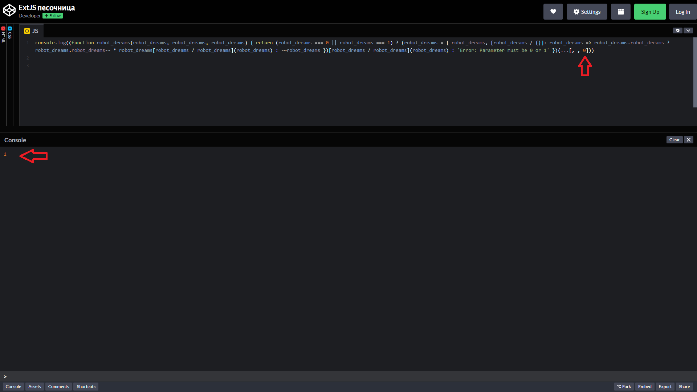
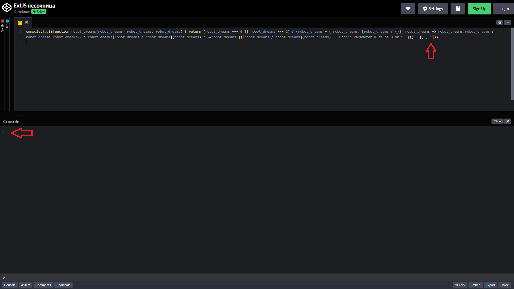
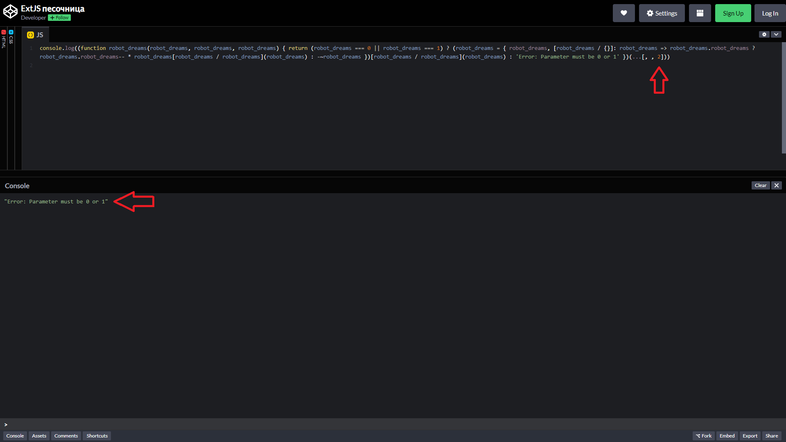

# Задача

Напишіть однорядковий код, який доводить, що роботи ніколи не сплять, і навіть коли вони роблять вигляд, що сплять, вони все одно залишаються активними.

## Перевірка активності роботів

Цей код перевіряє, чи активний робот, використовуючи механізм, що базується на значеннях, переданих у функцію.

## Умови:

- Значення `0` означає, що робот "спить".
- Значення `1` означає, що робот "активний".

## Функціонал:

- Якщо функція викликається зі значенням `1`, результат також буде `1`, що підтверджує, що робот активний.
- Якщо функція викликається зі значенням `0`, результат все одно буде `1`, що означає, що робот не спить, хоча йому передали значення, яке вказує на те, що він "спить".

Таким чином, цей код ілюструє парадоксальний сценарій, у якому роботи завжди залишаються активними, незалежно від стану, переданого у функцію.

Цей код базується на тому, що за означенням `0! = 1` та `1! = 1`. Код запускається прямо в консолі і при зміні параметрів з `0` на `1` видає у будь-якому разі результат `1`.

## Скриншоти роботи коду:

1. **Результат передачі значення `0`:**

   

2. **Результат передачі значення `1`:**

   

3. **Результат передачі значення `2` (виводить помилку):**

   

## Висновок:

Можна стверджувати, що роботи ніколи не сплять, оскільки результати завжди вказують на їхню активність. Навіть коли їм передають значення, що означає "сон", результат показує їхню активність.

Цей код виглядає як ускладнена і заплутана конструкція, яка, насправді, реалізує доволі просту логіку. Давайте розберемо його крок за кроком:

### Основні моменти:

1. **Функція з трьома однаковими параметрами**:
   ```javascript
   function robot_dreams(robot_dreams, robot_dreams, robot_dreams)
   ```
   Три однакові назви параметрів всередині функції — це незвичайний і заплутаний хід. У JavaScript дозволяється перевизначення параметрів, тому останній параметр `robot_dreams` замінить усі попередні. Тому по факту функція має лише один параметр, хоч виглядає як три. Це, скоріш за все, зроблено, щоб ще більше заплутати читача або підкреслити "парадокс" робота, що ніколи не спить.

2. **Умовне перевіряння `robot_dreams`**:
   ```javascript
   (robot_dreams === 0 || robot_dreams === 1)
   ```
   Тут перевіряється, чи передане значення дорівнює 0 або 1 — що є "сном" або "активністю" робота. Якщо так, то запускається наступна частина коду.

3. **Об'єкт `robot_dreams`**:
   ```javascript
   robot_dreams = { robot_dreams, [robot_dreams / {}]: robot_dreams => robot_dreams.robot_dreams ? robot_dreams.robot_dreams-- * robot_dreams[robot_dreams / robot_dreams](robot_dreams) : -~robot_dreams }
   ```
   Це складна та незвичайна частина. Вона використовує об'єкт, в якому ключем є результат виразу `robot_dreams / {}`, що породжує `NaN` (not a number). Таким чином, фактично створюється об'єкт, де є ключ `NaN`. Далі, ключем є функція, яка рекурсивно звертається до цього ж об'єкта і робить перевірки, чи робот активний (`robot_dreams.robot_dreams`).

4. **Рекурсія та побітові операції**:
   ```javascript
   robot_dreams.robot_dreams-- * robot_dreams[robot_dreams / robot_dreams](robot_dreams) : -~robot_dreams
   ```
   Тут використовується рекурсія та постфіксна декрементація `robot_dreams--`, яка одночасно змінює значення та звертається до об'єкта для подальших обчислень. Вираз `-~robot_dreams` є побітовою операцією, яка фактично додає одиницю до значення `robot_dreams`.

5. **Результат**:
   Код завжди повертає `1` незалежно від переданого значення (0 чи 1), завдяки хитрим обчисленням та рекурсії. Це доводить "парадокс", що робот завжди активний.

6. **Виклик функції**:
   ```javascript
   })(...[, , 0]));
   ```
   Функція викликається із трьома аргументами, з яких два є "порожніми", а третє — `0`. Це додатковий хід для плутанини, бо функція приймає лише один фактичний параметр — той, що дорівнює `0`.

### Унікальність та зайвість:

- **Заплутаність**: Більшість коду ускладнює читання та розуміння. Функція з трьома однаковими параметрами, використання рекурсії та побітових операцій, динамічне створення ключа `NaN` — усе це робить код незвичайним і незрозумілим на перший погляд.
  
- **Незвичні оператори**: Використання операторів декрементації та побітових операцій замість звичайного додавання та перевірки стану робить код важчим для розуміння.

- **Унікальність**: Незважаючи на зайвість, цей код демонструє глибоке знання JavaScript та його можливостей. Він навмисно спроектований, щоб виглядати складно і навіть трохи абсурдно, але в ньому є певна логіка.

### Підсумок:
Цей код ілюструє, як у JavaScript можна створити рекурсивні та незвичайні об'єкти й функції, які повертають неочікувані результати. Основна ідея коду — показати, що робот завжди активний, навіть якщо йому передано значення, що вказує на сон, — досягається через складну, але цікаву конструкцію.


## Однорядковий код:

```javascript
console.log((function robot_dreams(robot_dreams, robot_dreams, robot_dreams) { return (robot_dreams === 0 || robot_dreams === 1) ? (robot_dreams = { robot_dreams, [robot_dreams / {}]: robot_dreams => robot_dreams.robot_dreams ? robot_dreams.robot_dreams-- * robot_dreams[robot_dreams / robot_dreams](robot_dreams) : -~robot_dreams })[robot_dreams / robot_dreams](robot_dreams) : 'Error: Parameter must be 0 or 1' })(...[, , 0]));
```
